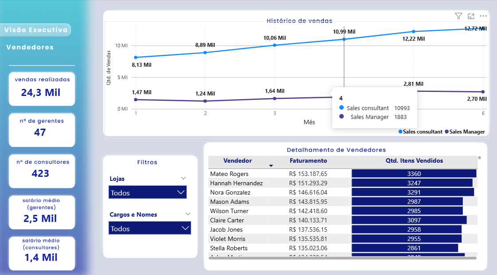
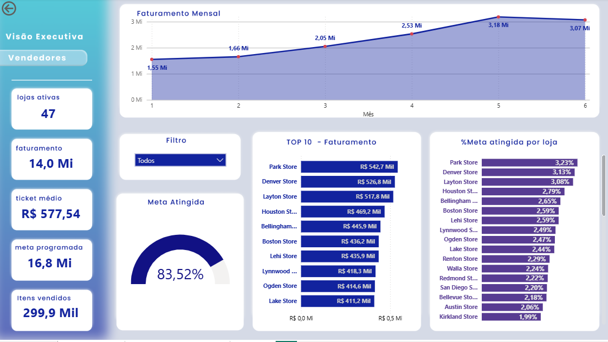

# Dashboard Comercial

Projeto de análise comercial desenvolvido com **Python** para tratamento de dados e **Power BI** para modelagem e visualização.

## Bases utilizadas

O projeto foi construído a partir de quatro bases:

- **Vendas**
- **Metas**
- **Lojas**
- **Consultores**

As duas planilhas de vendas foram consolidadas em uma única base para permitir análise integrada dos períodos.

---

## Etapas do projeto

### 1. ETL em Python

No tratamento dos dados, foram realizadas atividades como:

- leitura e consolidação dos arquivos;
- verificação de valores nulos;
- checagem de duplicidades;
- padronização de campos categóricos;
- tratamento de inconsistências;
- criação de colunas auxiliares de data, como ano, mês, semana e trimestre;
- exportação das bases tratadas para uso no Power BI.

### 2. Modelagem no Power BI

Após o tratamento, os dados foram importados para o Power BI e organizados em um modelo que permitisse o cruzamento entre vendas, metas, lojas e consultores.

Também foi criada uma **tabela de medidas**, com o objetivo de centralizar os cálculos em DAX e deixar o modelo mais organizado.

---


## Principais métricas

Entre as medidas desenvolvidas no projeto, estão:

- faturamento total;
- meta;
- percentual de meta atingida;
- ticket médio;
- quantidade de vendas;
- quantidade de itens vendidos;
- salário médio;
- quantidade de colaboradores por cargo.

---

## Estrutura do dashboard

O dashboard foi organizado em páginas para facilitar a navegação e evitar excesso de informação em uma única tela:

- **Visão Executiva**: indicadores principais e visão geral do desempenho;
- **Lojas**: comparação entre unidades;
- **Vendedores**: análise individual de performance;
- **Colaboradores / Salários**: visão da equipe e da estrutura salarial.

---

## Escolha dos visuais

Os visuais foram escolhidos de acordo com o objetivo de cada análise:

- **cards** para destacar KPIs principais;
- **gráficos de linha** para evolução temporal;
- **gráficos de barras** para comparações e rankings;
- **tabelas e matrizes** para detalhamento;
- **formatação condicional** para destacar melhores e piores desempenhos.

---

## Observações

Como a base possui **47 lojas** e **470 colaboradores**, foram aplicados filtros dinâmicos, rankings e recortes como **Top N** para melhorar a leitura e a usabilidade do painel.
---

## Estrutura do projeto

```bash
.
├── Comercial.ipynb            # Notebook com o processo de ETL e validações
├── comercial (2).py          # Script em Python com o tratamento das bases
├── Desafio.pbix              # Dashboard final no Power BI
├── README.md                 # Documentação do projeto
├── Visão Executiva.png       # Preview da página principal do dashboard
├── Vendedores (2).png        # Preview da página de vendedores
├── consultores_ok (2).xlsx   # Base tratada de consultores
├── lojas_ok (2).xlsx         # Base tratada de lojas
├── metas_ok (2).xlsx         # Base tratada de metas
└── vendas_total (2).xlsx     # Base consolidada de vendas
